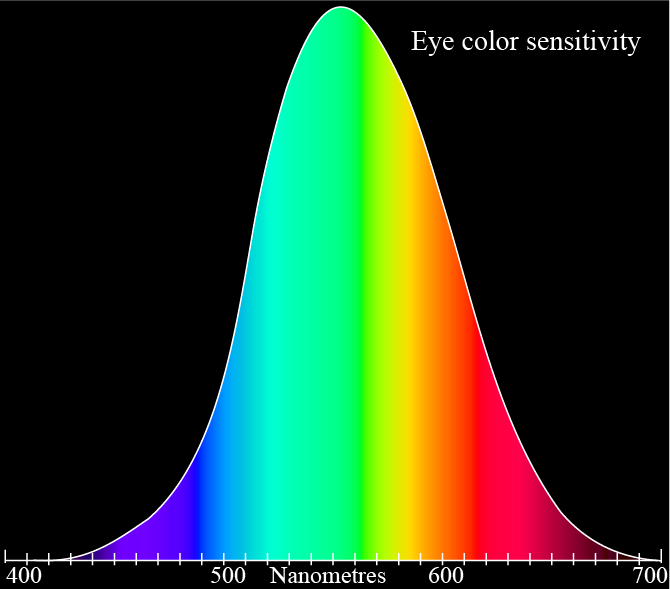
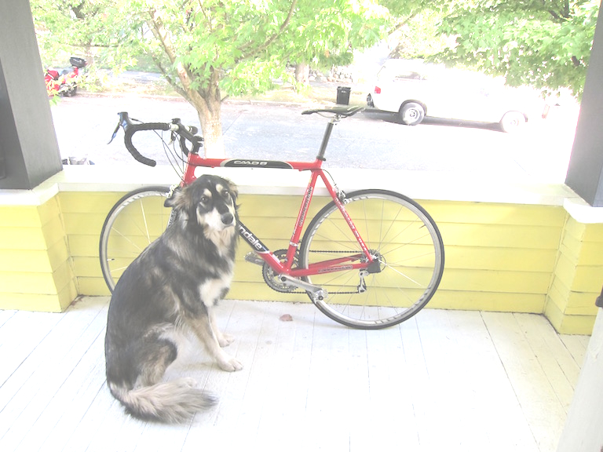
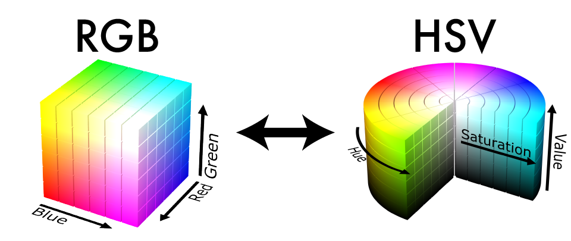
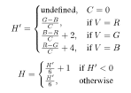
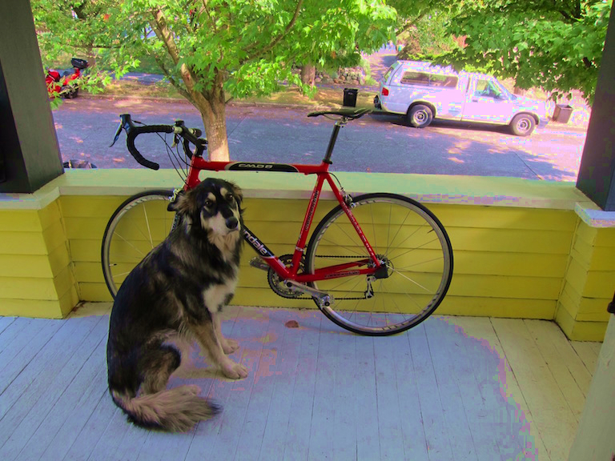

# Homework 1

对于第一次作业，我们只需了解一点代码库并练习简单的图像操作方法。

## 目录

- [设置代码仓库](#设置代码仓库)
- [下载编译代码](#下载编译代码)
- [运行测试代码](#运行测试代码)
- [图像操作基础](#图像操作基础)
- [题目 1. 获取和设置像素](#题目-1-获取和设置像素)
- [题目 2. 复制图像](#题目-2-复制图像)
- [题目 3. 灰度化图像](#题目-3-灰度化图像)
- [题目 4. 偏移图像颜色](#题目-4-偏移图像颜色)
- [题目 5. 截断像素值](#题目-5-截断像素值)
- [题目 6. RGB 转 HSV](#题目-6-rgb-转-hsv)
- [题目 7. HSV 转 RGB](#题目-7-hsv-转-rgb)
- [题目 8. 拓展作业 1（难度一般）](#题目-8-拓展作业-1难度一般)
- [题目 9. 拓展作业 2（稍难一些）](#题目-9-拓展作业-2稍难一些)
- [作业提交要求](#作业提交要求)

## 设置代码仓库

### 下载编译代码

1. 下载代码：从 Gitee 克隆仓库。

```bash
git clone https://gitee.com/ghgxj/Homework-1.git
```

2. 安装依赖：CMake。

```bash
https://cmake.org/install/
```

3. 编译代码：我们将使用 `cmake` 和 `make` 构建和编译库。这里，我们提供了一个 bash 脚本 [compile.sh](/compile.sh) 可以方便地为您完成此操作。建议使用 Linux 或 MacOS 来完成作业，因为设置 cmake 和 make 会更简单。

- Linux and MacOS

```bash
./compile.sh # runs cmake and make for you and produces ./test0, that is basically all you should need.
./clean.sh # cleans all files
./compile.sh # compiles again
```

- Windows

详见 [Windows 安装指南](README-Windows.md)。温馨提示：若目前手头只有windows系统的电脑，推荐安装 Linux 子系统（WSL），实测可用。

### 运行测试代码

每次对代码进行任何更改时，请运行上述编译命令。我们提供了一个简单的测试程序来测试一些功能。然后您可以通过运行以下命令来快速测试您的更改

```bash
./test0
```

如果运行上述代码而不对原始代码库进行任何更改，您将得到以下结果：

```bash
17 tests, 3 passed, 14 failed
```

一旦一切都正确实施，您将得到：

```bash
17 tests, 17 passed, 0 failed
```

请注意，通过所有测试并不能保证您的程序 100% 正确。我们将进行更广泛的测试。

## 图像操作基础

我们有一个基本的 c++结构来存储库中的图像。`Image` 结构体存储图像元数据，如宽度、高度和通道数。它还包含作为浮点数组存储的图像数据。你可以在 [src/image.h](/src/image.h) 中查看它，它看起来像这样:

```cpp
struct Image
{
    int h,w,c;
    float *data;
    .......
};
```

如果您想创建一个维度为宽度 x 高度 x 通道的新图像，您可以定义：

```cpp
Image im(w,h,c);
```

该结构定义了所有必要的运算符，因此您可以复制、重新分配、作为函数的引用传递等：

```cpp
Image im(5,6,7);
Image im2=im;

im=im2;

void scramble_image(const Image& image);
```

如果仅访问，则始终将图像作为 `const Image& image` 传递；如果要修改，则始终将图像作为 `Image& image` 传递。请参阅提供的代码以获取指导。

如果要访问像素，可以执行以下操作：

```cpp
float value = im(0,2,1); // gets the pixel at column 0, row 2 and channel 1
im(3,0,2) = 0.76;  // sets the pixel at column 3, row 0 and channel 2
```

如果指定越界坐标，则会出现错误。

我们还提供了一些用于加载和保存图像的功能。二进制格式可能会在课程的后期变得有用。使用任何函数（成员函数和独立函数）来加载新图像：

```cpp
Image im = load_image("image.jpg");
im.load_image("another.png");
im.load_binary("binary.bin");
```

要保存图像，请使用:

```cpp
im.save_image("output");   // save_image saves the image as a .jpg file
im.save_png("output");     // save_png  saves the image as a .png file
im.save_binary("output.bin"); // save_binary saves as a raw binary file
```

请随意探索 `image.h` 和 `struct Image {...}` 来熟悉上述操作。如果您对加载/保存的具体实现感兴趣，也可以浏览其他提供的文件。鉴于加载和保存图像很复杂，我们直接使用 `stb_image` 库来实现的。

---

<p style="color: red;">您将修改并只提交 `src/process_image.cpp` 和 `src/access_image.cpp` 两个文件。</p>

---

## 题目 1. 获取和设置像素

我们要做的最基本的操作是更改图像中的像素。我们将图像表示为 3 维张量。我们有空间信息以及多个通道，它们组合在一起形成彩色图像：


我们约定坐标系从图像的左上角开始，如下所示：


在我们的 `data` 数组中，我们以 `CHW` 格式存储图像。数据中的第一个像素位于通道 0、第 0 行、第 0 列（请注意，行对应于 Y 轴，列对应于 X 轴）。下一个像素是通道 0、第 0 行、第 1 列，然后是通道 0、第 0 行、第 2 列等。访问器运算符实际上需要像素值的地址 `data` `CHW` `image(1,2,1)`

您的第一个任务是在以下位置实现计算它的函数：[src/access_image.cpp](/src/access_image.cpp)

```cpp
int pixel_address(const Image& im, int x, int y, int ch);
```

`pixel_address` 应返回像素值在数据数组中的 `x,y,ch` 位置。

请注意，对于像素访问，运算符 `()` 对于 `Image` 是重载（overloaded）的（请参见 `image.h`）。它将使用您的 `pixel_address` 函数来查找正确的像素位置。

尽管默认情况下，像素访问运算符 `image(1,2,1)` 会执行边界检查。但在某些情况下，如果我们采用填充策略而不用担心边界，则会更容易。这里有许多可能的填充策略：


我们将使用 `clamp` 填充策略。这意味着，如果程序员要求在列 -3 处提供像素，则使用列 0，或者如果他们要求列 300 并且图像仅为 256x256，您将使用列 255（因为从零开始的索引）。

你的第二个任务是在 [src/access_image.cpp](/src/access_image.cpp) 中实现下列两个函数:

```cpp
float get_clamped_pixel(const Image& im, int x, int y, int ch);
void set_pixel(Image& im, int x, int y, int c, float value);
```

如果传入越界坐标（像素坐标大于宽度或高度，或小于零），`set_pixel` 应直接返回而不执行任何操作。

对于 `get_clamped_pixel`，我们将对图像进行填充。

请注意，你可以使用 `()` 操作符， 例如 `im(3, 2, 0)` 来访问像素。

我们可以通过移除所有红色通道来测试我们的像素设置代码对狗图片的效果。如果你愿意，可以创建一个类似于 `test0` 的新可执行文件，在其中可以使用你新编写的图像库进行探索。按照 `CMakeLists.txt` 和 `src/test/test0.cpp` 中的示例创建新的可执行文件。

```cpp
// 1-2. Getting and setting pixels
Image im2 = load_image("data/dog.jpg");
for (int i=0; i<im2.w; i++)
    for (int j=0; j<im2.h; j++)
        im2(i, j, 0) = 0;
im2.save_image("output/set_pixel_result");
```

然后尝试运行它。看看我们的非常不红的狗：


## 题目 2. 复制图像

有时您有一张图像并且想要复制它！为此，我们应该制作一个相同大小的新图像，然后填充新图像中的数据数组。您可以通过将一个图像中的像素分配给另一个图像、循环遍历整个数组并仅复制浮点数，或使用内置的内存复制功能 `memcpy`。在 `src/access_image.cpp` 文件中实现函数 `void copy_image(Image& to, const Image& from)`来完成复制图像的任务。

## 题目 3. 灰度化图像

现在让我们开始处理一些图像！人们喜欢将图像灰度化。这让他们看起来……老了？

还记得人类对所有颜色的看法不同吗？这是提醒您的图表：



这实际上在实践中产生了巨大的差异。这是我们可能想要转换的颜色条：


如果我们使用等权均值 K = (R+G+B)/3 进行转换，我们会得到一个与我们对给定颜色的感知不匹配的转换：


相反，我们将使用加权和。现在，有几种方法可以做到这一点。如果我们想要最准确的转换，则需要大量的工作。sRGB 使用[gamma 压缩](<https://en.wikipedia.org/wiki/SRGB#The_sRGB_transfer_function_(%22gamma%22)>)，因此我们首先要将颜色转换为线性 RGB，然后计算[相对亮度](https://en.wikipedia.org/wiki/Relative_luminance).

但是我们并不关心过于精确，所以我们将使用快速简单的版本。视频工程师使用一种称为 [luma](<https://en.wikipedia.org/wiki/Luma_(video)>) 的计算来在编码视频信号时找到感知强度的近似值，我们将使用它来将我们的图像转换为灰度。它直接作用于我们已经拥有的伽马压缩 sRGB 值！我们只需执行加权求和：

```bash
Y' = 0.299 R' + 0.587 G' + .114 B'
```

使用这种转换技术，我们得到了一个非常好的灰度图像！现在 `test0.cpp` 中的`test_grayscale()` 将输出。 `grayscale_result.jpg`。


你的任务是实现 `process_image.cpp` 中的 `rgb_to_grayscale` 函数。返回一张大小相同但只有一个通道包含计算的亮度值的新图像。

## 题目 4. 偏移图像颜色

现在让我们编写一个函数来将常数因子添加到图像中的通道。我们可以在图像中的每个通道上使用它来使图像更亮或更暗。例如，我们还可以使用它来将图像偏移为或多或少的给定颜色。

填写 `process_image.cpp` 中的 `void shift_image(image im, int c, float v);` 函数。 你应该添加 `v` 到图像通道 `c` 的每个像素中. 现在我们可以尝试将图像中的所有通道偏移 `.4` 或者 40%：

```cpp
// 4. Shift Image
shift_image(im, 0, .4);
shift_image(im, 1, .4);
shift_image(im, 2, .4);
im.save_image("output/shift_result");
```

但是，当我们查看生成的图像 `shift_result.jpg` 时，我们发现发生了一些不好的事情！图像的亮区超过了 1，当我们将图像保存回磁盘时，它溢出并形成奇怪的图案：


## 题目 5. 截断像素值

我们的图像像素值必须受到限制。通常，图像存储为字节数组，其中每个红色、绿色或蓝色值都是 0 到 255 之间的无符号字节。0 表示没有任何颜色光，255 表示尽可能多地显示原色光。

我们使用 0 到 1 之间的浮点值来表示图像。但是，我们仍然需要在浮点表示和存储在磁盘上的字节数组之间进行转换。在上面的示例中，我们的像素值超过 1，因此当我们将它们转换回字节数组并将它们保存到磁盘时，它们会溢出字节数据类型并返回到非常小的值。这就是为什么图像中非常亮的区域会循环并变暗的原因。

我们希望确保图像中的像素值保持在 0 和 1 之间。对图像的像素值实施截断，以便任何低于 0 的值都设置为 0，任何高于 1 的值都设置为 1。

填写 `process_image.cpp` 中的 `void clamp_image(image im);` 函数以实现原位（in-place）修改图像。然后，当我们截断上一步偏移后的图像并保存它时，我们会看到更好的结果：

```cpp
// 5. Clamp Image
clamp_image(im);
im.save_image("output/clamp_result");
```

以及生成的图像 `clamp_result.jpg`:



## 题目 6. RGB 转 HSV

到目前为止，我们一直关注 RGB 和灰度图像。但我们也可能想尝试其他颜色空间。如[Hue（色调）, Saturation（饱和度）和 Value（亮度），简称为 HSV)](https://en.wikipedia.org/wiki/HSL_and_HSV)。我们将把 sRGB 的颜色空间的立方体转换为色调、饱和度和亮度的圆柱体：



[色调](https://en.wikipedia.org/wiki/Hue)可以被认为是像素的基色. [饱和度](https://en.wikipedia.org/wiki/Colorfulness#Saturation) 是与白色（饱和度最低的颜色）相比的颜色强度。[亮度](https://en.wikipedia.org/wiki/Lightness)是像素与黑色相比的亮度感知。你可以点击此 [演示](http://math.hws.edu/graphicsbook/demos/c2/rgb-hsv.html) 以更好地感受这两个色彩空间之间的差异。对于这个变换的几何解释：


现在，可以肯定的是，这个色彩空间存在[很多问题](http://poynton.ca/notes/colour_and_gamma/ColorFAQ.html#RTFToC36). 但它仍然很有趣并且相对容易实现。最容易计算的分量是亮度，它只是 3 个 RGB 分量中最大的一个：

```bash
V = max(R,G,B)
```

接下来我们可以计算饱和度。这是衡量像素中颜色与中性白色/灰色相比的程度的指标。中性色的每三个颜色分量的数量相同，因此为了计算饱和度，我们会看到每个分量的颜色距离均匀程度有多远。首先我们找到最小值：

```bash
m = min(R,G,B)
```

然后我们看看最小值和最大值相差多远：

```bash
C = V - m
```

饱和度将是差值与最大值之间的比率：

```bash
S = C / V
```

除非 R、G 和 B 都为 0。因为这样 V 将为 0，而我们不想除以它，所以如果是这种情况，只需将饱和度设置为 0。

最后，为了计算色调，我们要计算目标颜色在颜色六边形周围的距离。


我们从红色开始计数。到六边形上的一个点的每一步都算作 1 个单位距离。点之间的距离由二次色的相对比率给出。我们可以使用[Wikipedia](https://en.wikipedia.org/wiki/HSL_and_HSV#Hue_and_chroma)中的以下公式:



如果 C = 0，则不存在“正确”色调，因为所有通道都相等，因此颜色是灰色阴影，位于圆柱体的中心。不过，现在如果 C = 0，我们就设置 H = 0，因为这样您的实现将与我的实现匹配。

请注意，我们将得到 H = \[0,1)，如果它变得太大或变为负数，它应该循环。因此，我们检查它是否为负数，如果是则加一。这与 H 在 0 到 6 或 0 到 360 之间的其他方法略有不同。我们将在同一图像中存储 H、S 和 V 分量，因此只需将 R 通道替换为 H，将 G 通道替换为 S，等。计算饱和度时请注意被零除！

填写 `process_image.cpp` 中的 `void rgb_to_hsv(Image& im)` 将 RGB 图像就地（in-place）转换为 HSV 图像。由于此转换是按像素完成的，因此您只需迭代每个像素并转换它们即可。

## 题目 7. HSV 转 RGB

现在我们来进行逆向变换。您可以使用以下等式：

```cpp
// Given the H, S, V channels of an image:
C = V * S
X = C * (1 - abs((6*H mod 2) - 1))  // You can use the fmod() function to do a floating point modulo.
m = V - C
```

注意：确保使用浮点数！整数除法的 1/6 为零。


```
(R, G, B) = (R'+m, G'+m, B'+m)
```

填写 `process_image.cpp` 中的 `void hsv_to_rgb(Image& im)` 实现就地（in-place）转换.

最后，当你完成后，我们可以处理一些图像！例如，将图像转换为 HSV，增加饱和度，然后将其转换回来：

```cpp
// 6-7. Colorspace and saturation
Image im2 = load_image("data/dog.jpg");
rgb_to_hsv(im2);
shift_image(im2, 1, .2);
clamp_image(im2);
hsv_to_rgb(im2);
im2.save_image("output/colorspace_result");
```



请注意，通过上述方法，我们确实得到了一些伪影，因为我们试图增加颜色很少的区域的饱和度。您可以按某个值缩放饱和度以获得更平滑的结果，而不是偏移饱和度！

## 题目 8. 拓展作业 1（难度一般）

实现 `void scale_image(image im, int c, float v);` 将通道缩放一定量. 这将为我们带来更好的饱和度结果。请注意，您必须将必要的行添加到头文件中,它应该与 `shift_image` 非常相似。现在，如果我们扩大 2 倍，而不是仅仅将其全部往上偏移来缩放饱和度，我们会得到更好的结果：

```cpp
Image im = load_image("data/dog.jpg");
rgb_to_hsv(im);
scale_image(im, 1, 2);
clamp_image(im);
hsv_to_rgb(im);
im.save_image("output/dog_scale_saturated");
```


## 题目 9. 拓展作业 2（稍难一些）

将 RGB 色彩空间转换到 [Hue, Chroma, Lightness](https://en.wikipedia.org/wiki/CIELUV#Cylindrical_representation_.28CIELCH.29)，这是 Hue、Saturation、Value 的感知上更准确的版本。请注意，这将涉及伽马解压缩、转换为 CIEXYZ、转换为 CIELUV、转换为 HCL 以及反向转换。优点是与 HSV 类似的色彩空间，但具有更好的感知特性！

## 作业提交要求

您只需要提交 `access_image.cpp` 和 `process_image.cpp` 2 个文件。将这两个文件打包为一个压缩包，并以 `学号-姓名.zip` 的格式命名，提交到[网络学堂](https://learn.tsinghua.edu.cn/)中。

不要更改任何其他文件，也不要更改函数的签名行。我们将依靠这些来保持测试的一致性。您可以自由定义任意数量的额外结构/类、函数、全局变量。不要提交任何额外的东西。

---

打分标准如下：

- 基本作业（必做，总计 25 分）
  | 函数 | 分数 |
  | :-- | :--- |
  | pixel_address | 2 |
  | get_clamped_pixel | 1 |
  | set_pixel | 3 |
  | copy_image | 2 |
  | rgb_to_grayscale | 2 |
  | shift_image | 3 |
  | clamp_image | 2 |
  | rgb_to_hsv | 5 |
  | hsv_to_rgb | 5 |

- 拓展作业（选做，总计 5 分）
  | 函数 | 分数 |
  | :-- | :---- |
  | scale_image | 1 |
  | rgb_to_lch | 2 |
  | lch_to_rgb | 2 |
