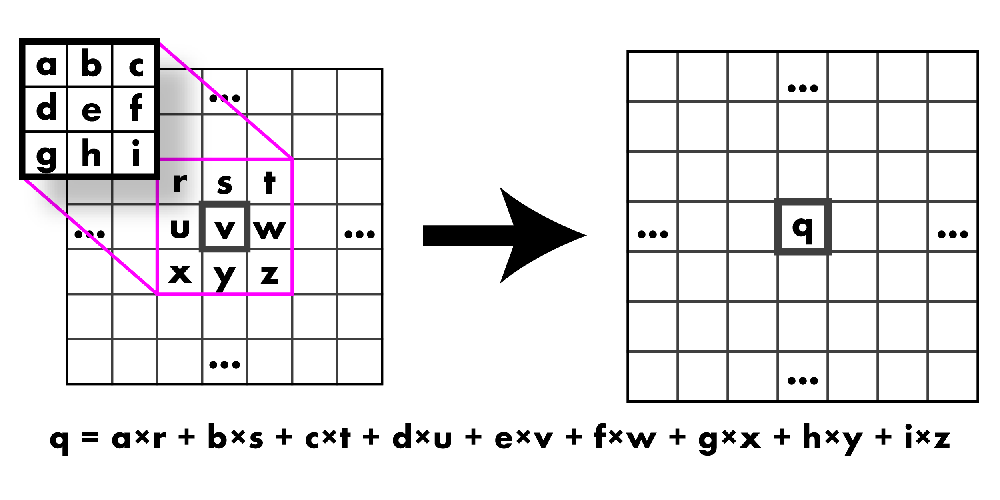
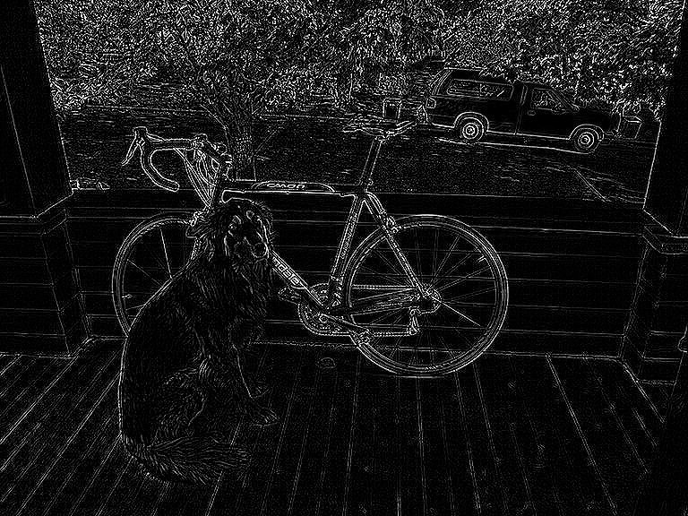
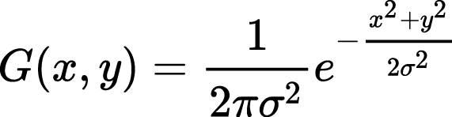
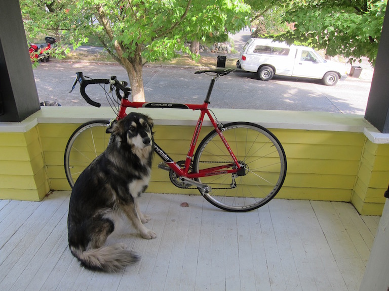

# Homework 2

第二次作业会比第一次作业稍难一些，您需要使用 `C++` 语言来编写你的代码，您仅需要提交 `resize_image.cpp` 和 `filter_image.cpp`两个文件。

## 目录

- [设置代码仓库](#设置代码仓库)
- [题目 1. 图像缩放](#题目-1-图像缩放)
- [题目 2. 使用卷积进行图像滤波](#题目-2-使用卷积进行图像滤波)
    - [2.1 创建您的盒状滤波器](#21-创建您的盒状滤波器)
    - [2.2 编写一个卷积函数](#22-编写一个卷积函数)
    - [2.3 制作更多滤波器并尝试它们！](#23-制作更多滤波器并尝试它们)
    - [2.4 实现高斯核](#24-实现高斯核)
- [题目 3. 混合图像](#题目-3-混合图像)
- [题目 4. Sobel 滤波器](#题目-4-sobel-滤波器)
    - [4.1 制作滤波器](#41-制作滤波器)
    - [4.2 另一种归一化...](#42-另一种归一化)
    - [4.3 计算梯度幅值和方向](#43-计算梯度幅值和方向)
    - [4.4 制作一个着色表示](#44-制作一个着色表示)
    - [4.5 尝试稍微不同的模糊（拓展作业）](#45-尝试稍微不同的模糊拓展作业)
- [作业提交要求](#作业提交要求)

## 设置代码仓库

和第一次作业类似，您需要先通过 Git 将代码仓库拷贝到您的本地计算机上。

开始作业之前，请将您第一次作业中提交的 `process_image.cpp` 文件复制到此作业中的 `src` 文件夹中进行替换。不要复制 `access_image.cpp`，因为该功能已经内置到 `image.h` 中。

其它设置请参考第一次的说明。

---

常见问题及解决方案：

1. 脚本执行权限问题

```bash
bash: ./compile.sh: Permission denied
```

你可以使用 `chmod` 命令来添加执行权限：`chmod +x compile.sh`，`clean.sh` 同理。

2. 脚本行尾格式问题

```bash
bash: ./clean.sh: /bin/bash^M: bad interpreter: No such file or directory
```

错误消息中的 `/bin/bash^M` 表明存在 Windows 样式的行尾符（\r\n），而不是 Unix 样式的行尾符（\n）。为了解决这个问题，您可以使用 dos2unix 命令将脚本中的行尾格式转换为 Unix 样式。具体操作步骤如下：

```bash
sudo apt-get install dos2unix
dos2unix clean.sh
```

转换完成后，再次尝试运行你的脚本：

```bash
./clean.sh
```

## 题目 1. 图像缩放

要实现图像缩放，我们将需要一些插值方法和一个函数来创建一个新的图像，并使用我们的插值方法填充它。

- 在 `src/resize_image.cpp` 中填写 `float Image::pixel_nearest(float x, float y, int c) const;`
  - 它应该执行最近邻插值。记住要使用最接近的 `int`，而不仅仅是类型转换，因为在 C 中这会朝向零截断。这是在 `Image` 类内部，为了方便，请使用成员函数 `clamped_pixel(a,b,c)`，而不是访问操作符 `()`。
  - 注意：请使用第一次作业中提到的像素坐标约定。
- 填写 `Image nearest_resize(const Image& im, int w, int h);`。它应该：
  - 创建一个新的图像，大小为 `w x h`，与 `im` 具有相同数量的通道
  - 循环遍历像素并映射回旧坐标
  - 使用最近邻插值来填充图像

您的代码将接受输入图像：


并将其转换为：


最后，填写类似的函数

```arduino
float Image::pixel_bilinear(float x, float y, int c) const;
Image bilinear_resize(const Image& im, int w, int h);
```

执行双线性插值后的的结果。


这些函数对于图像尺寸的小改变效果很好，但当我们尝试使图像更小，比如缩略图时，我们会得到非常嘈杂的结果。


正如我们讨论过的，我们需要在执行这种极端的调整大小操作之前进行滤波！

## 题目 2. 使用卷积进行图像滤波

我们将首先使用盒状滤波器对图像进行滤波。有一种非常快速的方法来执行此操作，但是我们将其实现为卷积，因为这将适用于其他滤波器！

### 2.1 创建您的盒状滤波器

我们想要创建一个类似下面的盒状滤波器：


一种方式是创建一个图像，全用 1 填充，然后进行归一化。这就是我们将要做的，因为归一化函数在将来可能会有用！

首先填写 `filter_image.cpp` 文件中的 `void l1_normalize(Image& im)` 函数。这应该将图像归一化为总和为 1。

接下来填写 `filter_image.cpp` 文件中的 `Image make_box_filter(int w)`。我们只会使用方形盒状滤波器，所以只需将您的滤波器制作为 `w x w`。它应该是一个具有统一条目的方形图像，这些条目相加为 1。

### 2.2 编写一个卷积函数

**我们称这个操作为卷积，但您不需要翻转滤波器或其他任何操作（我们实际上在做一种交叉相关）**。只需将其应用于图像：



现在是时候填写 `Image convolve_image(const Image& im, const Image& filter, bool preserve)` 了。对于这个函数，我们有一些情况需要讨论。对于正常的卷积，我们在图像的一片区域上进行加权求和。对于输入图像中的多个通道，我们想要处理几种可能的情况：

- 如果 `preserve` 设置为 `true`，我们应该生成一个与输入具有相同数量的通道的图像。例如，如果我们想要在 RGB 图像上运行盒状滤波器并得到一个 RGB 图像，那么这意味着图像中的每个通道将被相同的滤波器核分别过滤。除非：
- 如果 `preserve` 设置为 `false`，我们应该返回一个 1 通道图像，该图像是通过将滤波器核应用于每个通道，然后将通道相加而产生的。

此外，`filter` 应该只有 1 个通道。我使用 `assert` 来检查这一点。

完成后，通过过滤我们的图像来测试您的卷积！

我们将获得类似于下面的输出：


现在我们可以使用它来执行我们的缩略图操作。


看看我们的新调整大小的缩略图效果如何更好！

| 直接调整大小            | 先模糊然后调整大小     |
| ----------------------- | ---------------------- |
|  |  |

### 2.3 制作更多滤波器并尝试它们！

填写函数 `Image make_highpass_filter()`、`Image make_sharpen_filter()` 和 `Image make_emboss_filter()` 以实现更多的滤波器。在一些图像上尝试它们！

| 高通                       | 锐化                      | 浮雕                     |
| -------------------------- | ------------------------- | ------------------------ |
|      |      |      |
|  |  |  |

### 2.4 实现高斯核

实现 `Image make_gaussian_filter(float sigma)`，它将采用标准差值并返回使用该 sigma 平滑的过滤器。您会问，过滤器应该有多大呢？对于高斯分布，99% 的概率质量在 +/- 3 个标准差内，所以将核的大小设置为 sigma 的 6 倍。但同时我们希望它是一个奇数，所以将它设置为 6x sigma 的下一个最高奇整数。

我们需要在核中填入一些值。使用二维高斯的概率密度函数：



从技术上讲，这并不完美，我们真正想做的是对滤波器中的每个单元格覆盖的区域进行积分。但这更加复杂，这是一个还算不错的估计。但请记住，这是一个模糊滤波器，所以我们希望所有权重都加起来等于 1。

现在，您应该可以尝试您的新模糊函数了！


## 题目 3. 混合图像

高斯滤波器很酷，因为它们是图像的真正低通滤波器。这意味着当我们在图像上运行它们时，我们只会得到图像的低频变化，如颜色。相反，我们可以从原始图像中减去这些低频信息，以获取高频信息！

使用这种频率分离，我们可以做一些很有意思的事情。例如，请查看 [此 Photoshop 中关于修补皮肤的教程](https://petapixel.com/2015/07/08/primer-using-frequency-separation-in-photoshop-for-skin-retouching/)。

我们还可以制作[看起来不同的迷幻图像](http://cvcl.mit.edu/hybrid/OlivaTorralb_Hybrid_Siggraph06.pdf)，这取决于您离它们有多近或有多远。这就是我们将要做的。它们是混合图像，从一个图像中获取低频信息，从另一个图像中获取高频信息。这是一个......到底是什么的图片？

| 小                                   | 中                                    | 大                             |
| ------------------------------------ | ------------------------------------- | ------------------------------ |
|  |  |  |

如果您不相信我调整的图像大小，请查看 `figs/marilyn-einstein.png`，并从远处和近处查看它。很有意思，对吧？

您的任务是制作一个类似的图像。但是，我们不会使用著名的已故人士，而是使用著名的虚构人物！特别是，我们将揭示哈利·波特系列的秘密（但完全是官方剧情），邓布利多是一个时光旅行的罗恩·韦斯莱。不信？图像不会说谎！醒醒吧，羊群们！

| 小                             | 大                       |
| ------------------------------ | ------------------------ |
|  |  |

对于这项任务，您将不得不从一些图像中提取高频和低频信息。您已经知道如何获取低频，使用您的高斯滤波器。要获取高频，您只需从原始图像中减去低频数据。

填写 `Image add_image(const Image& a, const Image& b)` 和 `Image sub_image(const Image& a, const Image& b)`，这样我们就可以执行我们的转换。它们可能需要一些检查，确保图像的大小等相同。现在我们应该能够得到以下结果；

| 低频                        | 高频                         | 重建                      |
| --------------------------- | ---------------------------- | ------------------------- |
|  |  |  |

<!--注意，当我们将高频图像保存到磁盘时，它会溢出？这对我们来说是个问题吗？为什么？
使用这些函数重新创建您自己的 Ronbledore 图像。您将需要调整所使用的高斯函数的标准差。为了使其看起来好看，您可能需要为每个图像使用不同的值。-->

## 题目 4. Sobel 滤波器

[Sobel 滤波器](https://www.researchgate.net/publication/239398674_An_Isotropic_3x3_Image_Gradient_Operator) 很酷，因为我们可以估计图像中的梯度和这些梯度的方向。现在您们都是这样擅长图像滤波了，所以这应该很简单。

### 4.1 制作滤波器

首先在 `filter_image.cpp` 中实现 `make_gx_filter` 和 `make_gy_filter` 函数来制作我们的 Sobel 滤波器。它们用于估计 x 和 y 方向上的梯度：

| Gx               | Gy               |
| ---------------- | ---------------- |
|  |  |

### 4.2 另一种归一化...

为了可视化我们的 Sobel 运算符，我们将需要另一种归一化策略，即 [特征归一化](https://en.wikipedia.org/wiki/Feature_scaling)。该策略很简单，我们只想将图像的所有值缩放到 [0-1] 区间。特别是我们将对数据的范围进行 [重新缩放](https://en.wikipedia.org/wiki/Feature_scaling#Rescaling)，方法是从所有值中减去最小值并除以数据的范围。如果范围为零，您应该将整个图像设置为 0（不要除以 0，那是不好的）。

### 4.3 计算梯度幅值和方向

填写 `pair<Image,Image> sobel_image(const Image& im)` 函数。它应该返回两个图像，梯度幅值和方向。策略可以在 [这里](https://en.wikipedia.org/wiki/Sobel_operator#Formulation) 找到。我们可以使用我们的归一化函数来可视化我们的幅度。


### 4.4 制作一个着色表示

现在使用您的 Sobel 滤波器尝试制作一个很酷的、风格化的滤波器。填写 `Image colorize_sobel(const Image& im)` 函数。我将幅度作为图像的饱和度和值，并将角度（theta）作为色调，然后使用我们以前编写过的 `hsv_to_rgb` 函数。我们希望输出图像是一个有效的图像，因此请将范围规范化为 0-1：

- 通过特征归一化幅度；
- 通过除以 2π 并加上 0.5 来归一化角度。

在 `colorize_sobel` 中对原始图像进行一些平滑处理（使用 sigma 为 4 的高斯），这样看起来会更漂亮。


### 4.5 尝试稍微不同的模糊（拓展作业）

现在让我们尝试通过不仅基于像素的空间位置赋予周围像素权重来模糊，而且还通过像素的颜色与中心像素的远近来赋予权重。[双边滤波器](https://cs.jhu.edu/~misha/ReadingSeminar/Papers/Tomasi98.pdf) 的思想是模糊图像中的所有内容，但保留颜色边缘。

我们将再次形成一个滤波器，但现在每个像素的滤波器都会有所不同。像素的滤波器权重可以描述为：


其中单个权重为


（G 的定义在上面的第 2.4 节中）

而归一化因子为


对于一个大小为 (2k+1) 的核。

提示：对于空间高斯，您可以使用上面实现的`make_gaussian_filter`。对于颜色距离高斯，您应该分别计算每个通道的像素值之间的距离，并然后应用带有`sigma2`的高斯。

填写函数`Image bilateral_filter(const Image& im, float sigma1, float sigma2)`，其中`sigma1`用于空间高斯，`sigma2`用于颜色距离高斯。对于双边滤波器，使用`6*sigma1`的核大小。

您的图像应该具有与下面图片类似的效果，因此我们建议在提交最终图像之前尝试一些空间和颜色 sigma 参数（您可以在`data/bilateral_raw.png`中找到原始图像，请注意，它是 40x40 像素）。祝您好运！

| 处理前                      | 处理后                       |
| --------------------------- | ---------------------------- |
|  |  |


## 作业提交要求

您只需要提交 `resize_image.cpp` 和 `filter_image.cpp` 2 个文件。将这两个文件打包为一个压缩包，并以 `学号-姓名.zip` 的格式命名，提交到网络学堂中。

不要更改任何其他文件，也不要更改函数的签名行。我们将依靠这些来保持测试的一致性。您可以自由定义任意数量的额外结构/类、函数、全局变量。不要提交任何额外的东西。

---

打分标准如下：

- 图像缩放（必做，总计 6 分）
  | 函数 | 分数 |
  | ---------------- | ---- |
  |pixel_nearest|2|
  |pixel_bilinear|2|
  |nearest_resize|1|
  |bilinear_resize|1|
- 图像滤波（必做，总计 27 分）
  | 函数 | 分数 |
  |---|----|
  | l1_normalize | 1 |
  | make_box_filter|2|
  | convolve_image|2|
  | make_highpass_filter|2|
  | make_sharpen_filter|2|
  | make_emboss_filter|2|
  | make_gaussian_filter|2|
  | add_image|1|
  | sub_image|1|
  | make_gx_filter|2|
  | make_gy_filter|2|
  | feature_normalize|2|
  | feature_normalize_total|2|
  | sobel_image|2|
  | colorize_sobel|2|

- 拓展作业（选做，总计 2 分）
  | 函数             | 分数 |
  | ---------------- | ---- |
  | bilateral_filter | 2    |
